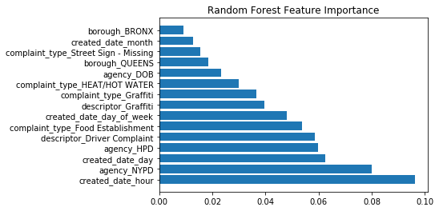

# Regression Predictions on NYC 311 Data
** Note that the EC2 nodes that were in place to showcase auto generating some dashboards & data have been shut down. I have progressed beyond this to using more asyncronous solutions such as Lambda and OpenWhisk. This project is archived and here to remind me how far I've come in my skill sets.
A more responsive version can be found on [GitHub Pages](https://nickeloustex.github.io/NYC-311-Regression-Predicting/)
## Table of Contents

* [The Data](#the-data)
* [Data Munging](#data-munging)
* [Data Analysis](#early-analysis)
* [Regression Modeling](#regression-modeling)
* [Daily Predictions](#daily-predictions)
* [Dashboards](#data-dashboards)
* [Conclusion](#conclusion)

## The Data:

As part of the open data project, New York City post data from a variety of Departments and other Government Entities. This project takes data from the NYC 311 Open Data set and attempts to predict future outcome of complaints.
  
    <b>What is 311?</b>
    311 was introduced as a non-emergency alternative to 911 in 1996 to help overwhelmed police emergency calls by providing citizens with an alternative three digit call number to voice complaints.
    311 use in NYC has seen explosive growth since tracking was first introduced in 2003. Growing from approximately 4.5 Million calls in its first year to over 20 million calls per year.
  
    <b>Why look at 311?</b>
    311 is a unique attempt by governments to be more responsive to their citizens concerns. 311 complaints vary widely from noise complaints to mental health services. Yet many people have never used 311. Often the response is "it won't get fixed, what's the point?"
  
    This project seeks to identify features that cause a 311 complaint to be responded to faster vs another. The project will attempt to predict new 311 calls close time to answer a fundamental question: <b>Can 311 Fix It?</b>

All of my code can be found within the [scripts folder](scripts/) in this repository.
Notebooks of my progress and analysis can be found in the [EDA folder](EDA/). 

## Data Munging 

As with most open data sets, there's a lot to explore and look through. With over 18 million rows and 41 features in just the past year, there was a lot to look through and make decisions on. A subset of 100k was worked on initially for cleaning before deploying on the larger data set. What was needed to figure out was-

 

 
<h4>How to get this:</h4>

<h4>To something more useful like this:</h4>

  We get there by lots of coding! There were plenty of redundant features as well as null and garbage inputs(for full cleaning analysis- see MVP notebook on Github):
  An Example:

<pre><code>print("Number of Community Boards: {}".format(api_df['community_board'].nunique()))
Number of Community Boards: 74
</pre></code>
<i>There are only 59 community boards in NYC!</i>
<pre><code>api_df_cleaned = api_df[api_df['community_board'].isin(community_board_list)]
Number of Community Boards: 59</code></pre>
  </ul>

</section>.

## Early Analysis
 
 

## Regression Modeling 

Once data cleaning was completed it was time to find a model to predict estimated time of outcomes.
    Random Forest & Gradient Boost models were picked because of their robustness to overfitting. A Neural Net was considered but was decided against because the ability to rate feature importance was considered a good education factor. Random Forest and Gradient Boost provided this.

<pre><code>random_forest = RandomForestRegressor()
random_forest.fit(X_train, y_train)
print('R2 score {}'.format(random_forest.score(X_test,y_test)))
R2 score 0.7741774171081134
</code></pre>
 
 Feature importance is helpful because it allows us to make recommendation on specific items that may have a causal effect on outcome. This has to be approached cautiously. Note that NYPD is rated as a high feature importance. This makes sense considering that NYPD handles the largest share of complaints. By their nature as well, NYPD complaints also tend to be closed faster, as opposed to an inquiry about taxes made to Department of Finance.

<pre><code>gradient_boost = GradientBoostingRegressor()
gradient_boost.fit(X_train, y_train)
print('R2 score {}'.format(gradient_boost.score(X_test,y_test)))
R2 score 0.7141774171081134
</code></pre>

We can also compare feature importance by model. Note that many of the same features show up in both.

## Daily Predictions

Every morning at 02:30AM predictions are generated via an AWS EC2 instance for the previous days calls. Total results are saved to a SQL table. Today's current predictions, as well as previous predictions and their actual times are embeded via HTML.
 
<h2>Today's predictions</h2>
<iframe width="900" height="400" frameborder="0" scrolling="yes" src="predictions_table.html"></iframe>
<h2>Current Comparision Results:</h2>
<iframe width="900" height="400" frameborder="0" scrolling="yes" src="predictions_table.html"></iframe>
 
<h2>Results:</h2>
As you can see results can be hours off, while R^2 score is still at .77. Scoring is based on overall model prediction. When an issue that takes a week to resolve prediction also off by 2 days, that is weighted heavily. When an issue is resolved in 3 hours and the prediction was at 6 hours, this is weighted less. This judgment was made because the experience of time. Predictions that are within hours of their actual time to close are within a standard of error from a person’s perspective of time. While predictions that are days off, even if they take weeks to close, are large from a person's perspective.

## Data Dashboarding
  <h1>Data Dashboarding:</h1>
  <ul class="posts">
  <b>There's a problem with trying to visualize large open data sets...</b>
    

    
    

    It’s hard to do!
    Visualization on NYC’s OpenData is erratic at best. During the course of this project I never once got it to work. This lead to some contemplation on what might be a better way to display information of interest to the average data seeker.
      
    With this in mind, I set out to create example dashboards that are updated daily - using SodaPy and querying Open Data’s own information. This gave me an advantage of minimal storage locally, and thus giving me more space to create impactful maps to visualize interesting data.

<!--undo-->
<!-- <iframe width="900" height="800" frameborder="0" scrolling="no" src="//plot.ly/dashboard/nickeloustex:10/embed"></iframe> -->
    
 
 
<b>These dashboards can be created using SQL calls using the existing API:</b>
<pre><code>time = datetime.utcnow()-timedelta(days=7)
time_string = '{}-{}-{}T00:00:00.000'.format(time.year,time.month,time.day)
query = "created_date > '{}' AND complaint_type LIKE '%Homeless%' ".format(time_string)
results = client.get(database_311, select=select_sql, where=query, limit=100000)
</code></pre>

## Conclusion:
Regression prediction is hard on a large data set as 311. Auto-closes and non-closes are particularly problematic as the sheer number of them can mask the problem. There are plenty of issues with the data. While there does appear to be some standards when it comes to complaint types and descriptions, there also is a significantly large number of one off complaint types.
      
    311 seems to recognize this and their web app limits their users to 7 specific complaint types. At the same time it directs more specific inquiries to their respective departments.
      
Recommendations would still include dealing with the auto close problem. Standardizing complaints down to a core 20-30, or having an “Other” category rather than over 200 descriptors might also be a good way to get more accurate data. It’s also unclear if agencies are responsible or measured by their 311 report performance.

